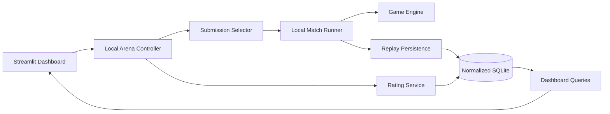
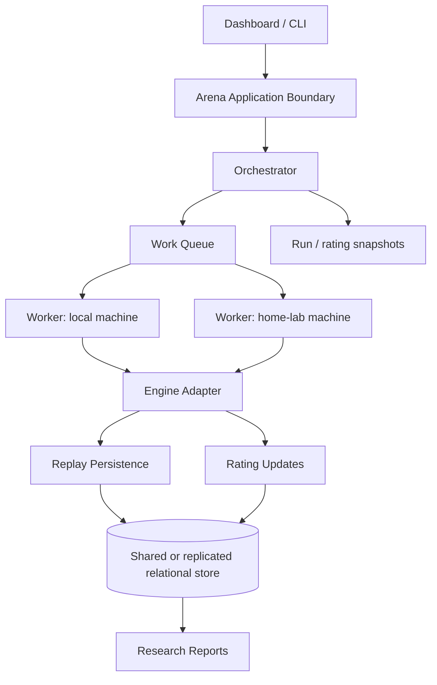

# Arena local — visão futura e fronteiras de evolução

Este documento registra a visão futura discutida para a arena, sem ampliar o escopo da primeira implementação. A primeira versão continua síncrona e local; este desenho apenas impede que o domínio seja acoplado a um único processo ou computador.

## Escopo atual

The controller runs synchronously, owns one local execution at a time and commits each match atomically with its normalized replay rows and rating evidence.

## Future service boundary

The future boundary is an application seam, not a requirement to introduce a network service now. A worker should receive a serializable *work claim* (submission IDs, deck IDs, configuration ID and seed), execute the game and return structured result rows. It should not own the domain rules or invent schema decisions.

## Patterns worth carrying forward

### From Red Team Arena

- A controller owns tournament orchestration.
- Agent/model implementations are behind stable interfaces or registries.
- Rating updates are a service with explicit pools and snapshots.
- Experiments are first-class and produce structured results.
- Dashboard queries are separate from the execution loop.
- Each run has a durable identity and a reportable result.

### From Co-Scientist

- An experiment has lifecycle state and durable provenance.
- Configuration is frozen per execution; later edits do not rewrite history.
- Long work can be paused/resumed and bounded by a scheduler.
- A final research report is derived from structured execution records.
- A task queue is an implementation detail behind an application boundary, not the domain model itself.

### From the Bitcoin Core analogy

The useful analogy is disciplined state transition and durable evidence: explicit inputs, deterministic state changes, atomic persistence, recovery from a known state and independently inspectable records. It is not a reason to copy Bitcoin's peer-to-peer protocol or consensus machinery into this project.

## Deliberate non-goals for now

- No distributed workers.
- No network protocol.
- No always-on daemon.
- No concurrent SQLite writers.
- No queue table required for the synchronous v2 baseline.
- No consensus or peer-to-peer replication.

## Schema implications for v2

The local schema should nevertheless include stable concepts that will remain valid later:

- `arena_runs`: identity, configuration, lifecycle and source of an execution;
- `arena_run_submissions`: submissions selected for that run;
- `matches`: individual game evidence linked to the run;
- `rating_snapshots`: point-in-time ratings linked to a run;
- immutable configuration records linked to the run;
- explicit result status and failure metadata.

These are ordinary relational records in the synchronous version. A future queue or worker can claim an `arena_run` or a partition of its planned matches without changing the meaning of the evidence.

## Research/reporting contract

Every run should eventually answer:

1. Which model artifact and deck revision participated?
2. Which opponent and deck revision were used?
3. Which tournament configuration and random seed were applied?
4. Which source pool produced the rating evidence?
5. Which replay rows and observations support the result?
6. What changed from the previous experiment or submission?

The service future is successful only if it preserves these answers. Throughput or always-on execution is secondary to traceable, reproducible evidence.
