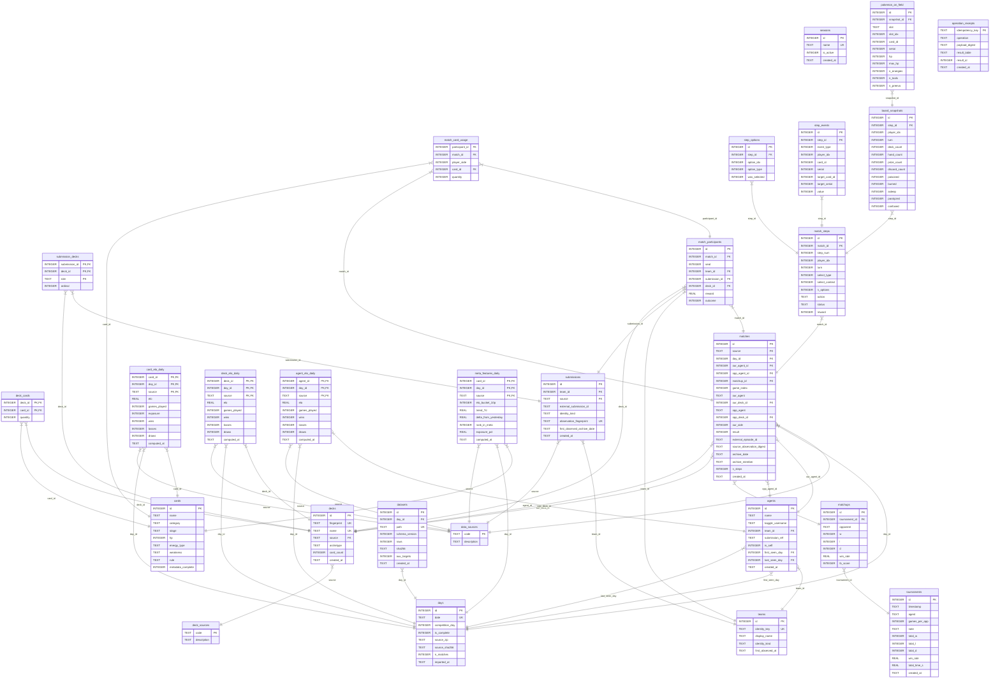

# Current SQLite Database Schema

```mermaid
erDiagram
    teams {
        INTEGER id PK
        TEXT identity_key UK
        TEXT display_name
        TEXT identity_kind
        TEXT first_observed_at
    }
    cards {
        INTEGER id PK
        TEXT name
        TEXT category
        TEXT stage
        INTEGER hp
        TEXT energy_type
        TEXT weakness
        TEXT rule
        INTEGER metadata_complete
    }
    decks {
        INTEGER id PK
        TEXT fingerprint UK
        TEXT name UK
        TEXT source FK
        TEXT archetype
        INTEGER card_count
        TEXT created_at
    }
    deck_cards {
        INTEGER deck_id PK, FK
        INTEGER card_id PK, FK
        INTEGER quantity
    }
    submissions {
        INTEGER id PK
        INTEGER team_id FK
        TEXT source FK
        TEXT external_submission_id
        TEXT identity_kind
        TEXT observation_fingerprint UK
        TEXT first_observed_archive_date
        TEXT created_at
    }
    submission_decks {
        INTEGER submission_id PK, FK
        INTEGER deck_id PK, FK
        TEXT role PK
        INTEGER ordinal
    }
    days {
        INTEGER id PK
        TEXT date UK
        INTEGER competition_day
        INTEGER is_complete
        TEXT source_zip
        TEXT source_sha256
        INTEGER n_matches
        TEXT imported_at
    }
    agents {
        INTEGER id PK
        TEXT name
        TEXT kaggle_username
        INTEGER team_id FK
        TEXT submission_ref
        INTEGER is_self
        INTEGER first_seen_day FK
        INTEGER last_seen_day FK
        TEXT created_at
    }
    matches {
        INTEGER id PK
        TEXT source FK
        INTEGER day_id FK
        INTEGER our_agent_id FK
        INTEGER opp_agent_id FK
        INTEGER matchup_id FK
        INTEGER game_index
        TEXT our_agent
        INTEGER our_deck_id FK
        TEXT opp_agent
        INTEGER opp_deck_id FK
        INTEGER our_side
        INTEGER result
        TEXT external_episode_id
        TEXT source_observation_digest
        TEXT archive_date
        TEXT archive_member
        INTEGER n_steps
        TEXT created_at
    }
    match_participants {
        INTEGER id PK
        INTEGER match_id FK
        INTEGER seat
        INTEGER team_id FK
        INTEGER submission_id FK
        INTEGER deck_id FK
        REAL reward
        INTEGER outcome
    }
    match_card_usage {
        INTEGER participant_id FK
        INTEGER match_id FK
        INTEGER player_side
        INTEGER card_id FK
        INTEGER quantity
    }
    seasons {
        INTEGER id PK
        TEXT name UK
        INTEGER is_active
        TEXT created_at
    }
    data_sources {
        TEXT code PK
        TEXT description
    }
    deck_sources {
        TEXT code PK
        TEXT description
    }
    card_elo_daily {
        INTEGER card_id PK, FK
        INTEGER day_id PK, FK
        TEXT source PK, FK
        REAL elo
        INTEGER games_played
        INTEGER exposure
        INTEGER wins
        INTEGER losses
        INTEGER draws
        TEXT computed_at
    }
    deck_elo_daily {
        INTEGER deck_id PK, FK
        INTEGER day_id PK, FK
        TEXT source PK, FK
        REAL elo
        INTEGER games_played
        INTEGER wins
        INTEGER losses
        INTEGER draws
        TEXT computed_at
    }
    agent_elo_daily {
        INTEGER agent_id PK, FK
        INTEGER day_id PK, FK
        TEXT source PK, FK
        REAL elo
        INTEGER games_played
        INTEGER wins
        INTEGER losses
        INTEGER draws
        TEXT computed_at
    }
    meta_features_daily {
        INTEGER card_id PK, FK
        INTEGER day_id PK, FK
        TEXT source PK, FK
        INTEGER elo_bucket_10p
        REAL trend_7d
        REAL delta_from_yesterday
        INTEGER rank_in_meta
        REAL exposure_pct
        TEXT computed_at
    }
    tournaments {
        INTEGER id PK
        TEXT timestamp
        TEXT agent
        INTEGER games_per_opp
        TEXT note
        INTEGER total_w
        INTEGER total_l
        INTEGER total_d
        REAL win_rate
        REAL total_time_s
        TEXT created_at
    }
    matchups {
        INTEGER id PK
        INTEGER tournament_id FK
        TEXT opponent
        INTEGER w
        INTEGER l
        INTEGER d
        REAL win_rate
        INTEGER lb_score
    }
    match_steps {
        INTEGER id PK
        INTEGER match_id FK
        INTEGER step_num
        INTEGER player_idx
        INTEGER turn
        INTEGER select_type
        INTEGER select_context
        INTEGER n_options
        TEXT action
        TEXT status
        INTEGER reward
    }
    step_options {
        INTEGER id PK
        INTEGER step_id FK
        INTEGER option_idx
        INTEGER option_type
        INTEGER was_selected
    }
    step_events {
        INTEGER id PK
        INTEGER step_id FK
        INTEGER event_type
        INTEGER player_idx
        INTEGER card_id
        INTEGER serial
        INTEGER target_card_id
        INTEGER target_serial
        INTEGER value
    }
    board_snapshots {
        INTEGER id PK
        INTEGER step_id FK
        INTEGER player_idx
        INTEGER turn
        INTEGER deck_count
        INTEGER hand_count
        INTEGER prize_count
        INTEGER discard_count
        INTEGER poisoned
        INTEGER burned
        INTEGER asleep
        INTEGER paralyzed
        INTEGER confused
    }
    pokemon_on_field {
        INTEGER id PK
        INTEGER snapshot_id FK
        TEXT slot
        INTEGER slot_idx
        INTEGER card_id
        INTEGER serial
        INTEGER hp
        INTEGER max_hp
        INTEGER n_energies
        INTEGER n_tools
        INTEGER n_preevo
    }
    datasets {
        INTEGER id PK
        INTEGER day_id FK
        TEXT path UK
        INTEGER schema_version
        INTEGER rows
        TEXT sha256
        INTEGER aux_targets
        TEXT created_at
    }
    operation_receipts {
        TEXT idempotency_key PK
        TEXT operation
        TEXT payload_digest
        TEXT result_table
        INTEGER result_id
        TEXT created_at
    }

    decks }|--|| deck_sources : "source"
    deck_cards }|--|| decks : "deck_id"
    deck_cards }|--|| cards : "card_id"
    submissions }|--|| teams : "team_id"
    submissions }|--|| data_sources : "source"
    submission_decks }|--|| submissions : "submission_id"
    submission_decks }|--|| decks : "deck_id"
    agents }|--|| teams : "team_id"
    agents }|--|| days : "first_seen_day"
    agents }|--|| days : "last_seen_day"
    matches }|--|| data_sources : "source"
    matches }|--|| days : "day_id"
    matches }|--|| agents : "our_agent_id"
    matches }|--|| agents : "opp_agent_id"
    matches }|--|| matchups : "matchup_id"
    matches }|--|| decks : "our_deck_id"
    matches }|--|| decks : "opp_deck_id"
    match_participants }|--|| matches : "match_id"
    match_participants }|--|| teams : "team_id"
    match_participants }|--|| submissions : "submission_id"
    match_participants }|--|| decks : "deck_id"
    match_card_usage }|--|| match_participants : "participant_id"
    match_card_usage }|--|| matches : "match_id"
    match_card_usage }|--|| cards : "card_id"
    card_elo_daily }|--|| cards : "card_id"
    card_elo_daily }|--|| days : "day_id"
    card_elo_daily }|--|| data_sources : "source"
    deck_elo_daily }|--|| decks : "deck_id"
    deck_elo_daily }|--|| days : "day_id"
    deck_elo_daily }|--|| data_sources : "source"
    agent_elo_daily }|--|| agents : "agent_id"
    agent_elo_daily }|--|| days : "day_id"
    agent_elo_daily }|--|| data_sources : "source"
    meta_features_daily }|--|| cards : "card_id"
    meta_features_daily }|--|| days : "day_id"
    meta_features_daily }|--|| data_sources : "source"
    matchups }|--|| tournaments : "tournament_id"
    match_steps }|--|| matches : "match_id"
    step_options }|--|| match_steps : "step_id"
    step_events }|--|| match_steps : "step_id"
    board_snapshots }|--|| match_steps : "step_id"
    pokemon_on_field }|--|| board_snapshots : "snapshot_id"
    datasets }|--|| days : "day_id"
```
