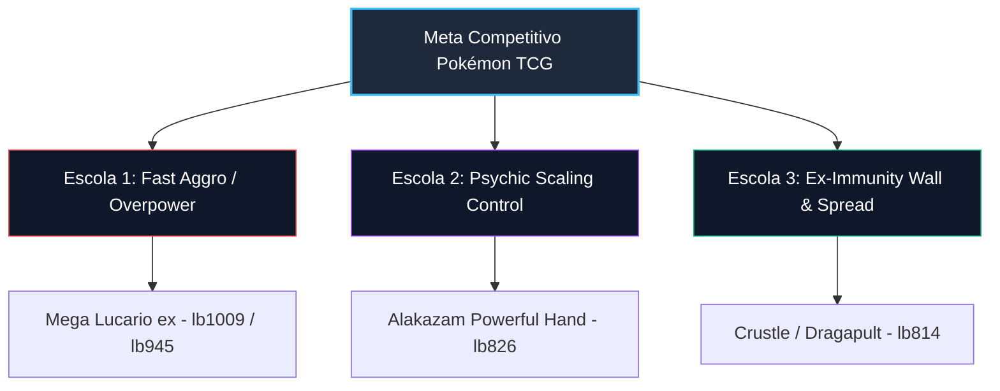

# Dissecação de Arquétipos & Análise de Meta Leaderboard

## 1. Topografia do Meta

O painel de avaliação externo utilizado no autoresearch reflete as três principais escolas de construção de decks observadas no topo da competição:

---

## 2. Dissecação dos Arquétipos Adversários

### A. Mega Lucario ex Fast Aggro (`lb1009` & `lb945`)
- **Linha Principal**: Riolu (ID 673) $\rightarrow$ Lucario (ID 674) $\rightarrow$ Mega Lucario ex (ID 678 - 340 HP).
- **Vetor de Ameaça**: *Carmine* (ID 1192 x4) permite descartar a mão e comprar 5 cartas no Turno 1 indo primeiro. Com *Gutsy Pickaxe* e aceleração de energia de luta ({F}), ataca no Turno 2 com *Mega Brave* causando **270 de dano**.
- **Ponto Fraco Explorável**:
  1. Fraqueza $2\times$ a Psíquico ({P}).
  2. Restrição de ataque consecutivo após *Mega Brave*.
  3. Dependência de energias de descarte e vulnerabilidade a atacantes de 1 prêmio.

### B. Alakazam / Dudunsparce Control (`lb826_alakazam_seok`)
- **Linha Principal**: Abra (ID 741) $\rightarrow$ Kadabra (ID 742) $\rightarrow$ Alakazam ex (ID 743). Suporte de Dudunsparce (ID 305) e Fezandipiti ex (ID 140).
- **Vetor de Ameaça**: *Powerful Hand* causa **20 de dano por carta na mão** por apenas 1 energia psíquica ({P}). Sem disrupção, a mão atinge 12–14 cartas (240–280 de dano).
- **Ponto Fraco Explorável**:
  1. *Judge* (ID 1213) e *Unfair Stamp* (ID 1080) forçam a mão para 4 ou 2 cartas, colapsando o dano de *Powerful Hand* para 40–80.
  2. Abra possui apenas 50 HP e é vulnerável a *Munkidori* (Adrena-Brain 30 dano) e *Boss's Orders*.

### C. Crustle / Dragapult Spread (`lb814_crustle_emre`)
- **Linha Principal**: Dwebble (ID 344) $\rightarrow$ Crustle (ID 345).
- **Vetor de Ameaça**: Habilidade *Mysterious Rock Inn* torna Crustle **completamente imune a danos de Pokémon ex**.
- **Ponto Fraco Explorável**:
  1. *Tapu Bulu* (ID 920 - 140 HP) é um Pokémon Básico que **não é ex**. Seu ataque *Wood Hammer* causa **220 de dano**, nocauteando Crustle em um único golpe.
  2. *Battle Cage* (ID 1264) bloqueia colocação de contadores de dano no banco.

---

## 3. Matriz de Contramedidas por Deck Candidato

| Arquétipo Adversário | Contramedida v0 (Supreme) | Contramedida v1 (Tempo) | Contramedida v2 (Control) | Contramedida v3 (Apex Sovereign) |
| :--- | :--- | :--- | :--- | :--- |
| **Mega Lucario (`lb1009`/`lb945`)** | Munkidori + Tapu Bulu | 4x Carmine + Tapu Bulu | 2x Munkidori + Tapu Bulu | **2x Carmine + 2x Tapu Bulu + 2x Munkidori** |
| **Alakazam (`lb826`)** | 1x Judge + 1x Stamp | 1x Judge + 1x Stamp | 2x Judge + 3x Boss + 3x Munkidori | **2x Judge + 1x Stamp + 3x Boss + 2x Munkidori** |
| **Crustle (`lb814`)** | 2x Tapu Bulu | 2x Tapu Bulu | 2x Tapu Bulu (60% WR) | **2x Tapu Bulu + 2x Battle Cage** |
| **Baseline first_sub (#251)** | Latias ex Skyliner | Latias ex Skyliner | Latias ex Skyliner (40% WR) | **Latias ex Skyliner + 4x Poké Pad** |
