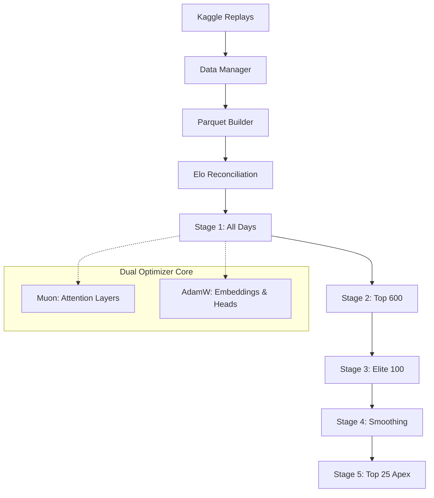

# Capítulo 8: Orquestração de Currículo, Otimização Dual e DevOps

Treinar uma matriz de RL complexa sobre milhões de linhas em Memória Unificada requer isolamento rigoroso de estágios e uma pipeline idempotente que não colapse se interrompida. O projeto consolida este esforço no orquestrador `experiments/curriculum_v1.py` e nas definições hiperparamétricas do `configs/train_config.json`.

## 8.1. O Pipeline Idempotente (Curriculum V1)
A fundação do processo é a função `pre_suite_enrichment()`. Antes de compilar os gradientes, o motor assegura integridade absoluta dos dados:
1. **Download Assíncrono:** Varre zips arquivados e baixa partidas ausentes do servidor Kaggle.
2. **Atualização Bayesiana:** Refaz o *Day ID* e calcula o Elo Diário no banco (cartas, decks e agentes).
3. **Parquet Build:** Injeta novos episódios em matrizes de compressão colunar (Parquet), prontas para o *Data Loader* continuo.
4. **Reconciliação:** Alinha o Elo local dos *Decks* com o Kaggle Leaderboard real.

Esta rotina garante que executar `uv run tcg-curriculum-v1` seja imutável aos olhos do estado: se falhar no Estágio 3, ele retomará os pesos do Estágio 2 intactos sem corromper tensores.

## 8.2. A Matemática do *Dual Optimizer* (Muon + AdamW)
Diferente da abordagem acadêmica genérica (usar um único AdamW), a configuração ativa o `muon_adamw`.
- **AdamW ($\beta_1=0.9, \beta_2=0.999$, Weight Decay $0.01$):** Atua nas matrizes de *Embedding* densas e nas *Pointer-Heads* projetadas (Value, Auxiliares, Opt).
- **Muon (Momentum $0.95$, Weight Decay $0.01$):** Otimizador com ortogonalidade forçada, restrito aos tensores internos do *Transformer* (*Q, K, V, Out*). A projeção de Newton-Schulz do Muon reduz a necessidade de normalizações pesadas e acelera a convergência geométrica da Atenção.

## 8.3. O Afunilamento das *Learning Rates*
O currículo não afunila apenas a qualidade dos dados, mas estrangula matematicamente a amplitude do salto estocástico:
| Estágio | Target | Frequência de Linhas | Learning Rate (Cosseno) | Épocas |
| :--- | :--- | :--- | :--- | :--- |
| **Stage 1** | População Global | 30.000 / dia | $1.5 \times 10^{-4}$ | 15 |
| **Stage 2** | Bronze+ (Top 600) | 300.000 / dia | $8.0 \times 10^{-5}$ | 5 |
| **Stage 3** | Elite (Top 100) | 300.000 / dia | $3.0 \times 10^{-5}$ | 10 |
| **Stage 4** | Elite Estabilizada | 80.000 / dia | $1.0 \times 10^{-5}$ | 5 |
| **Stage 5** | Apex (Top 25) | Todas disponíveis | $5.0 \times 10^{-6}$ | 5 |

No Estágio 5, com LR travada em $5e-6$, a rede sofre apenas um polimento microscópico (Micro-Finetuning). Ela preserva as memórias de anomalias (Capítulo 6) e foca apenas em afiar os hiperplanos de decisão de alto nível, preparando o campo para a transição algorítmica final.

## 8.4. Telemetria Ativa e Tensorboard
Como evidenciado no diretório `runs/`, cada micro-passo é exportado em tempo real:
- *Cache Hit Rates* (Monitoramento das falhas do *Parquet KV Cache* e despejos para o disco transiente).
- *Auxiliary Losses* (Os decaimentos isolados de `aux_ko_weight = 0.5` mapeados contra a convergência do Valor Total).
Esta integração permite intervenção termodinâmica humana, validando as estruturas do TBPTT (`tbptt_chunk = 16`) sem a necessidade de re-execuções dispendiosas.
