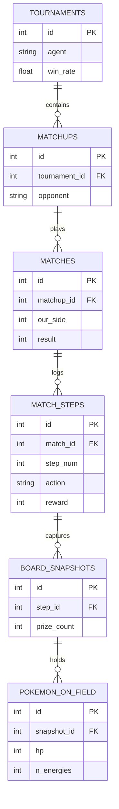

# Capítulo 9: Orquestrador de Torneios, Relacionalidade DB e Geometria de Inferência

A validação de uma política de inteligência artificial não pode ser estritamente analítica (funções de perda de treinamento); ela requer prova balística em cenários de informação assimétrica contra oponentes não-vistos.

## 9.1. O Motor de Varredura (Deck Sweeps)
O *script* `tournament.py` foi delineado para impedir viés de confirmação (testar o Agente contra apenas um arquétipo).
- **Varredura Assimétrica (`--opp-top-decks`):** O sistema isola os melhores *decks* remotos (extraídos do Kaggle) e força o oponente (seja a versão antiga do nosso agente ou agentes da comunidade) a jogar utilizando este baralho ótimo.
- **Exportação Automática (`--emit-best-performing-deck`):** Após o encerramento do *Round-Robin* (30 partidas, com reversão de turno inicial para mitigar *First-Player Advantage*), o sistema processa a matriz de *Win Rate* de cada deck e exporta silenciosamente o `deck.csv` da configuração mais letal para o diretório local de submissão do Agente.

## 9.2. Telemetria Relacional: A Esquematização do `results.db`
O banco SQLite retém um mapeamento celular de cada confronto. Não há agregações obscuras; a rede mantém granularidade atômica (passo a passo de cada duelo):

Essa conectividade retroativa é a espinha dorsal de como o sistema gera e corrige a matemática Invariante de Elo (detalhada no Capítulo 7).

## 9.3. Geometria Híbrida: O Paradigma Torch vs MLX
A análise dos empacotamentos no `pyproject.toml` expõe uma engenhosa disrupção estrutural (Separação Base-Treino-Implantação).

**1. O Motor de Otimização (Apple Silicon MLX)**
O treinamento e o empacotamento KV Cache do TBPTT ocorrem unicamente sobre a biblioteca nativa da Apple (`mlx>=0.32.0`). O motor C++ interno explora a Memória Unificada, evitando que as imensas cargas do *Parquet Row-Groups* engarrafe as transferências CPU/GPU tradicionais. O *Flash Attention* customizado do MLX possibilita o enxugamento de `_OPT_BUCKETS` sem dependências CUDA.

**2. O Oráculo de Inferência (PyTorch FP16)**
Apesar do aprendizado nativo no Mac, a infraestrutura Kaggle roda um *Sandbox* Python isolado, inóspito ao MLX. A resposta do projeto é transmutar os pesos treinados no Mac em matrizes FP16 puras via PyTorch (`torch>=2.13.0`). 
No momento do comando final (`tcg-build`), os arquivos empacotados (`submission.tar.gz`) descartam o MLX e carregam o estado para a arquitetura Pytorch `TokenTransformer` análoga (`policy.py`). Essa cisão perfeita entre Pesquisa Estocástica de Baixo Nível (Hardware Próprio) e Implantação Universal (Kaggle Cloud) preserva a leveza atencional e destrava o processo completo sem amarras físicas.
