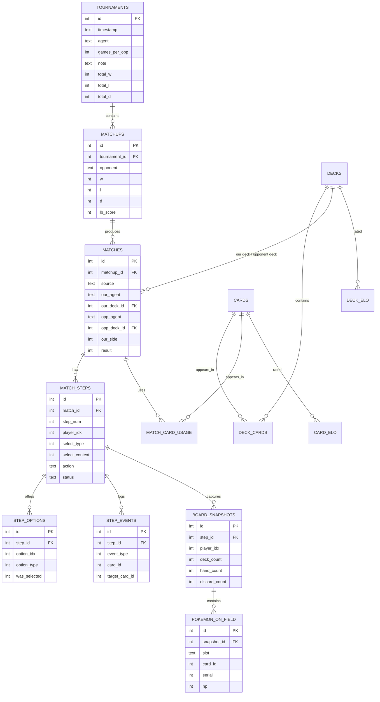

# Schema evolution — current state and relational v2

This document records the database baseline and the target architecture for the Pokémon TCG research platform. It is intentionally part of the project documentation: rating results are only useful if the data lineage, experiments and replay reconstruction can be explained and reproduced.

The diagrams are logical views. The v2 diagram is the design under review; it is not authorization to implement until the table-level review is complete.

## Current physical state

The current database is created in `rl/results_db.py`. It already stores tournament summaries, catalog rows, individual matches, replay steps, options, events, board snapshots, field Pokémon and source-separated card/deck Elo. It also contains known design debt:

- agents and sources are text fields rather than relational identities;
- replay action and enum values are serialized/magic values;
- there is no `zone_cards` relation;
- deck composition has no immutable revision identity;
- agent–deck rating lineages, experiments, anamnese and dashboard configuration do not exist;
- `matchups.replay_html` is an unused legacy column and is not part of the target design.



## Target relational v2

The target separates stable identity, immutable evidence and derived aggregates. Every enum-like domain has its own reference table and foreign key. No replay JSON, JSON string, opaque blob or HTML is stored.

```mermaid
erDiagram
    DATA_SOURCES ||--o{ TOURNAMENTS : classifies
    TOURNAMENT_CONFIGS ||--o{ TOURNAMENTS : configures
    TOURNAMENTS ||--o{ MATCHUPS : contains
    MATCHUPS ||--o{ MATCHES : produces
    MATCHES ||--o{ MATCH_PARTICIPANTS : has
    AGENTS ||--o{ MATCH_PARTICIPANTS : participates
    DECK_REVISIONS ||--o{ MATCH_PARTICIPANTS : uses

    DECK_FAMILIES ||--o{ DECK_REVISIONS : versions
    DECK_REVISIONS ||--o{ DECK_REVISION_CARDS : contains
    CARDS ||--o{ DECK_REVISION_CARDS : included
    DECK_SOURCES ||--o{ DECK_FAMILIES : classifies

    AGENTS ||--o{ AGENT_CONFIGS : versions
    AGENTS ||--o{ AGENT_NOTES : observes
    AGENTS ||--o{ AGENT_DECK_LINEAGES : owns
    DECK_REVISIONS ||--o{ AGENT_DECK_LINEAGES : rated_with
    DATA_SOURCES ||--o{ AGENT_DECK_LINEAGES : separates

    MATCHES ||--o{ MATCH_STEPS : has
    MATCH_STEPS ||--o{ STEP_ACTIONS : records
    MATCH_STEPS ||--o{ STEP_OPTIONS : offers
    MATCH_STEPS ||--o{ STEP_EVENTS : logs
    MATCH_STEPS ||--o{ BOARD_SNAPSHOTS : captures
    BOARD_SNAPSHOTS ||--o{ ZONE_CARDS : contains
    BOARD_SNAPSHOTS ||--o{ POKEMON_ON_FIELD : places
    ZONES ||--o{ ZONE_CARDS : classifies
    CARDS ||--o{ ZONE_CARDS : identified

    AGENTS ||--o{ EXPERIMENTS : owns
    EXPERIMENTS ||--o{ EXPERIMENT_NOTES : records
    EXPERIMENTS ||--o{ TRAINING_RUNS : may_have
    TRAIN_CONFIGS ||--o{ TRAINING_RUNS : configures
    EXPERIMENTS ||--o{ EXPERIMENT_DECK_TESTS : evaluates
    DECK_REVISIONS ||--o{ EXPERIMENT_DECK_TESTS : tested
    EXPERIMENTS ||--o{ REPLAY_ANALYSES : contains
    MATCHES ||--o{ REPLAY_ANALYSES : analyzed

    DECK_REVISIONS ||--o{ DECK_RATINGS : aggregates
    CARDS ||--o{ CARD_RATINGS : aggregates
    DATA_SOURCES ||--o{ DECK_RATINGS : separates
    DATA_SOURCES ||--o{ CARD_RATINGS : separates

    AGENTS ||--o{ SUBMISSIONS : promoted_to
    TEAMS ||--o{ SUBMISSIONS : owns
    SUBMISSIONS ||--o{ COMPETITION_EPISODES : exposes

    AGENT_STATUSES ||--o{ AGENTS : classifies
    EXPERIMENT_TYPES ||--o{ EXPERIMENTS : classifies
    EXPERIMENT_STATUSES ||--o{ EXPERIMENTS : classifies
    MATCH_STATUSES ||--o{ MATCH_STEPS : classifies
    EVENT_TYPES ||--o{ STEP_EVENTS : classifies
    OPTION_TYPES ||--o{ STEP_OPTIONS : classifies
    SELECT_TYPES ||--o{ MATCH_STEPS : classifies
    POKEMON_SLOTS ||--o{ POKEMON_ON_FIELD : classifies

    AGENTS {
        int id PK
        text stable_identity
        int status_id FK
        text display_name
        boolean favorite
    }
    DECK_FAMILIES {
        int id PK
        text display_name
        int source_id FK
    }
    DECK_REVISIONS {
        int id PK
        int family_id FK
        int revision_number
        text immutable_label
        int card_count
    }
    DECK_REVISION_CARDS {
        int deck_revision_id PK_FK
        int card_id PK_FK
        int quantity
    }
    AGENT_DECK_LINEAGES {
        int id PK
        int agent_id FK
        int deck_revision_id FK
        int source_id FK
        real elo
        int games_played
    }
    MATCHES {
        int id PK
        int matchup_id FK
        int experiment_id FK
        int source_id FK
        int result
    }
    MATCH_PARTICIPANTS {
        int match_id PK_FK
        int side PK
        int agent_id FK
        int deck_revision_id FK
    }
    MATCH_STEPS {
        int id PK
        int match_id FK
        int step_number
        int player_idx
        int status_id FK
    }
    ZONE_CARDS {
        int id PK
        int snapshot_id FK
        int zone_id FK
        int card_id FK
        int serial
        int player_idx
    }
    EXPERIMENTS {
        int id PK
        int agent_id FK
        int type_id FK
        int status_id FK
    }
```

## Why this matters for the research report

The target model makes each research claim traceable:

- a leaderboard result points to a submission and agent identity;
- an arena result points to a tournament, configuration, participant pair and immutable deck revisions;
- an Elo change points to source-separated match evidence;
- a replay observation points to a normalized step, event, zone and card;
- a training result points to a normalized train configuration and experiment history;
- a hypothesis or adjustment points to a time-stamped experiment observation.

This is the basis for explaining not only *who won*, but which agent version, deck revision, data source, tournament configuration and training decision produced the result.

## Review boundary

The v2 diagram is the current design proposal. The next review should validate, table by table:

1. exact fields extracted from the environment replay JSON;
2. exact participant identity available for local and remote matches;
3. deck family/revision semantics in the deck builder;
4. the rating update grain and source boundaries;
5. experiment type-specific relations;
6. provider fields for Kaggle teams/submissions/episodes.

Only after those checks should the physical DDL replace `rl/results_db.py`.
